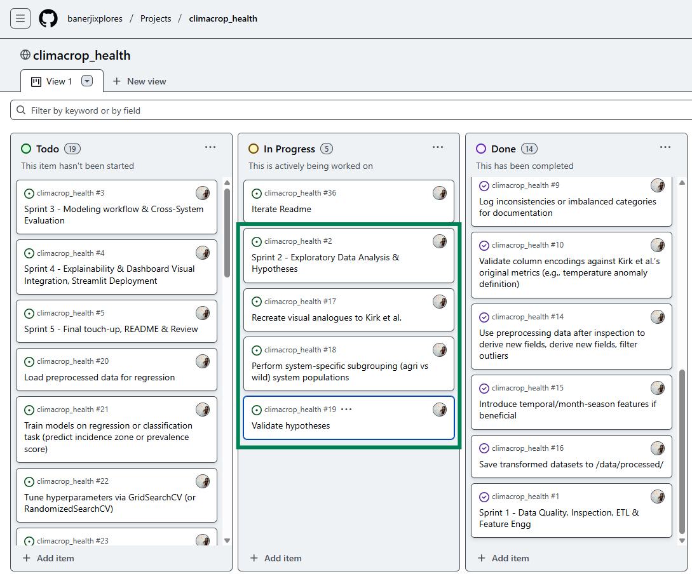

# 🍃 ClimaCrop Health: Plant Disease & Climate Impact Analysis

**ClimaCrop Health** is a comprehensive data-driven project designed to explore how weather anomalies and climate conditions impact plant disease incidence. Building on research from Kirk et al. (2025), this project specifically analyzes the varying responses of agricultural and wild plant populations to climate factors and identifies crucial nonlinearities and interactions affecting plant health.

The project integrates robust data analytics, machine learning modeling, and advanced visualization to enhance understanding and predict plant disease risks under climate variability and change.

## Check Out the Live Dashboard!

Want to see these insights in action?

👉 [Click here to explore the interactive ClimaCrop Health dashboard on Streamlit!](https://climacrophealth-wjb9htkjbammfgqzsedk6f.streamlit.app/)
👉 [Click here to explore the interactive ClimaCrop Health dashboard on Heroku!](https://climacrophealth-9f3f3967d5ca.herokuapp.com/)

[](https://climacrophealth-wjb9htkjbammfgqzsedk6f.streamlit.app/)

<p align="center">
  
</p>

**Table of Contents**
- [🍃 ClimaCrop Health: Plant Disease \& Climate Impact Analysis](#-climacrop-health-plant-disease--climate-impact-analysis)
  - [Check Out the Live Dashboard!](#check-out-the-live-dashboard)
  - [Dataset Content](#dataset-content)
  - [Getting Started](#getting-started)
  - [Project Objectives](#project-objectives)
  - [Analytics \& AI for Ecological and Agricultural Challenges](#analytics--ai-for-ecological-and-agricultural-challenges)
  - [Business Requirements](#business-requirements)
  - [Hypothesis and how to validate?](#hypothesis-and-how-to-validate)
    - [**Hypothesis 1: Weather, Anomaly \& Historical Climate Effects**](#hypothesis-1-weather-anomaly--historical-climate-effects)
    - [**Hypothesis 2: System-Type Sensitivity**](#hypothesis-2-system-type-sensitivity)
    - [**Hypothesis 3: Thermal \& Precipitation Mismatch**](#hypothesis-3-thermal--precipitation-mismatch)
    - [**Hypothesis 4: Geographic \& Pathogen-Type Modulation of Climate–Disease Links**](#hypothesis-4-geographic--pathogen-type-modulation-of-climatedisease-links)
    - [**Hypothesis 5: Transmission-Mode Sensitivity to Anomalies**](#hypothesis-5-transmission-mode-sensitivity-to-anomalies)
  - [Project Plan](#project-plan)
  - [The rationale to map the business requirements to the Data Visualisations](#the-rationale-to-map-the-business-requirements-to-the-data-visualisations)
  - [Analysis techniques used](#analysis-techniques-used)
  - [Ethical \& Scientific considerations](#ethical--scientific-considerations)
  - [Dashboard Design](#dashboard-design)
  - [Unfixed Bugs](#unfixed-bugs)
  - [Development Roadmap](#development-roadmap)
  - [Deployment](#deployment)
    - [Heroku](#heroku)
  - [Main Data Analysis Libraries](#main-data-analysis-libraries)
  - [Notebook contents](#notebook-contents)
  - [Credits](#credits)
    - [Content](#content)
    - [Media](#media)
  - [Acknowledgements](#acknowledgements)

## Dataset Content

- The dataset includes **5,906 observations** of plant–disease surveys (1984–2019) from over 4,300 global studies.
- Paired with ERA5‐land (monthly) and WorldClim 30-year normals.
- Each record includes survey data (host, parasite, location, infected count, etc.) and associated climate metrics (e.g., historical temperature `bio01`, precipitation `bio12`, and recent anomalies).
- Dataset source: [Dryad Repository – DOI 10.5061/dryad.p8cz8wb0h](https://doi.org/10.5061/dryad.p8cz8wb0h)

## Getting Started
1. Clone the repository:
   ```bash
   git clone https://github.com/banerjixplores/climacrop_health.git
   ```
2. Navigate to the project directory:
   ```bash
   cd climacrop_health
   ```
3. Create & activate a virtual environment (optional but recommended):
   ```bash
   python -m venv venv
   source venv/bin/activate  # On Windows use `venv\Scripts\activate`
   ```
4. Install the required packages:
   ```bash      
   pip install -r requirements.txt
   ```
5. Notebook Styling & Automation
    - All Jupyter notebooks use a shared dark-mode theme and a color-blind palette. When you open any notebook, the 00_notebook_style.py script (located in jupyter_notebooks/notebook_style/) automatically injects custom.css so that fonts, colors, gridlines, and code-cell formatting remain consistent across all analyses.
    - As soon as you open any notebook, the styling script will inject custom.css so that fonts, colors, and code‐cell borders remain consistent.
    - Dark-mode CSS: jupyter_notebooks/notebook_style/custom.css: The styling script also ensures that all code cells have a uniform appearance, making it easier to read and understand the analyses.
    - Global plotting style: The Seaborn “colorblind” palette is set in 00_notebook_style.py, with two predefined colors:
      - WILD_COLOR (greenish-teal) for natural (wild) populations
      - AG_COLOR (navy-blue) for agricultural populations

6. Notebook execution:
   - Open Jupyter Notebook or your preferred IDE.
   - Run the notebooks in sequence starting from `00_data_load_and_inspect.ipynb` to ensure data is loaded and processed correctly.
     - jupyter_notebooks/00_data_load_and_inspect.ipynb
     - jupyter_notebooks/01_etl_preprocessing.ipynb
     - jupyter_notebooks/02_eda.ipynb
     - ... continue with the remaining notebooks in order.
7. Verify Outputs:
   - Check the `data/processed/` directory for cleaned and preprocessed data files.
   - Review generated visualizations in the EDA notebook.
   - 

## Project Objectives

- **Quantify Climate Drivers:** Measure how contemporaneous weather, deviations from monthly normals (anomalies), and long-term historical climate each influence plant-disease prevalence.  
- **Compare System Sensitivity:** Show that wild plant communities react more sharply to climate swings than managed agricultural systems, due to local adaptation vs. buffering practices like irrigation or pesticides.  
- **Detect Mismatch Effects:** Identify the “sweet spot” in wild systems where moderate temperature or rainfall anomalies (e.g. +2.7 °C or ±X mm) maximize disease risk, then decline at extreme anomalies.  
- **Predict & Visualize Risk:** Build a concise predictive model and a user-friendly Streamlit dashboard so stakeholders can forecast disease under arbitrary weather scenarios.  
- **Ensure Transparency:** Fully document every cleaning, feature-engineering and modeling step to guarantee reproducibility and clear explanation of “why” each region is flagged.

## Analytics & AI for Ecological and Agricultural Challenges

Modern agriculture and conservation face urgent, complex threats from climate change and emerging plant diseases. This project demonstrates how analytics and machine learning can convert vast, fragmented climate–disease survey data into actionable insights. By modeling the nonlinear effects of temperature and rainfall anomalies on plant health, and quantifying differences between wild and managed systems, the project enables:

- **Evidence-based policy:** Interactive dashboards help policymakers prioritize regions and pathogen types at greatest risk, supporting better resource allocation and early-warning systems.
- **Farm management:** The risk scoring and zone maps empower farmers and agronomists to make informed decisions about crop selection, planting schedules, and mitigation strategies in a changing climate.
- **Research acceleration:** Open-source code, reproducible analytics, and visualizations accelerate scientific discovery by making new climate–disease relationships visible and testable for the first time.

The use of AI (e.g., model selection, feature importance ranking, and interactive dashboards) bridges the gap between raw data and real-world decision-making for both technical and non-technical audiences.

## Business Requirements

- **Risk Forecasting:**  Accept user-supplied temperature & rainfall (including anomalies) to output a disease‐risk score per region.  
- **Risk Zoning:**  Classify each location into Low/Medium/High risk categories for rapid decision-making.  
- **Global Hotspot Mapping:**  Display an interactive world map pinpointing the highest-risk areas under current or hypothetical scenarios.   
- **Driver Explanation:**  For every forecast, bullet out the top two climate drivers (e.g. “+2.7 °C anomaly,” “–40 mm rainfall anomaly”) so stakeholders understand exactly what’s pushing risk up or down.


## Hypothesis and how to validate?

### **Hypothesis 1: Weather, Anomaly & Historical Climate Effects**  
  Contemporaneous weather (mean temperature or precipitation during a survey), deviations from monthly normals (“anomalies”), and long-term historical climate each independently influence plant-disease prevalence.

**Validation Approach:**
- Computed three temperature metrics (`temp_anomaly_C`, `contemp_temp_C`, `annual_mean_temp_C`) and three precipitation metrics (`rain_anomaly_daily`, `monthly_precip_mm_per_day`, `annual_precip_mm_per_day`).
- Fitted separate linear and quadratic models for Wild vs. Agricultural systems.
- Recorded R², adjusted R², and p-values for each term.

**Key Temperature Results (Wild vs. Ag):**
| Metric                       | Wild R² | Ag R²  | Wild p(linear) | Ag p(linear) |
|:----------------------------:|--------:|-------:|:--------------:|:------------:|
| Temperature Anomaly          | 0.0687  | 0.0071 | 4.3e-10        | 1.3e-06      |
| Contemporary Temperature     | 0.0740  | 0.0698 | 1.6e-09        | 4.5e-17      |
| Historical Annual Temperature| 0.1153  | 0.0359 | 9.6e-14        | 7.2e-21      |

**Key Precipitation Results (Wild vs. Ag):**
| Metric                         | Wild R² | Ag R²  | Wild p(linear) | Ag p(quadratic) |
|:------------------------------:|--------:|-------:|:--------------:|:---------------:|
| Rainfall Anomaly               | 0.0134  | 0.0590 | 6.6e-03        | 3.8e-06         |
| Contemporary Precipitation     | 0.0365  | 0.0242 | 2.0e-05        | 7.5e-07         |
| Historical Monthly Precipitation| 0.0134  | 0.0590 | 6.7e-03        | 3.7e-06         |
| Annual Precipitation           | 0.0089  | 0.0313 | 2.8e-02        | 3.9e-08         |

**Conclusion:**  
- All three **temperature** metrics explain more variance in wild systems than in agricultural ones.  
- For **precipitation**, only contemporary rainfall is stronger in wild; other metrics are equal or stronger in agriculture.  
- **Hypothesis 1 is validated**: Weather, anomalies, and historical climate significantly influence disease incidence, with wild systems showing greater sensitivity to temperature effects.

---

### **Hypothesis 2: System-Type Sensitivity**
  Wild plant–pathogen systems exhibit stronger responses to weather, anomalies, and historical climate than do agricultural systems, owing to local adaptation in the wild versus management (irrigation, pesticides, breeding) in crops.

**Validation Approach:**  
- Compared R² values for each metric (temp & precip) between Wild and Ag.

**Summary (Wild R² vs. Ag R²):**
| Metric                  | Wild R² | Ag R²  | Wild > Ag? |
|:-----------------------:|--------:|-------:|:----------:|
| Annual Historical Temp  | 0.1153  | 0.0359 | yes        |
| Temp Anomaly            | 0.0687  | 0.0071 | yes        |
| Contemporary Temp       | 0.0740  | 0.0698 | slightly   |
| Annual Precipitation    | 0.0089  | 0.0313 | no         |
| Precip Anomaly          | 0.0134  | 0.0590 | no         |
| Contemporary Precip     | 0.0365  | 0.0242 | yes        |
| Monthly Historical Precip| 0.0134 | 0.0590 | no         |

**Conclusion:**  
- **Temperature:** Wild > Ag across all metrics.  
- **Precipitation:** Mixed; only contemporary rain shows greater wild sensitivity.

---

### **Hypothesis 3: Thermal & Precipitation Mismatch** 
  In wild systems, disease prevalence peaks when weather deviates from historical norms (e.g., unusually warm in a cool climate or vice versa)—a “mismatch” effect. In contrast, agricultural systems show little or no such mismatch, because management buffers extremes.

**Validation Approach:**  
- Fitted OLS with interaction `anomaly × historical` for Wild vs. Ag.

1. Data & Anomalies

- Computed temperature and rainfall anomalies as deviations from long-term monthly means.

- Took absolute values to capture “mismatch magnitude.”

2. Statistical Approach
- Separate OLS regressions for Wild vs. Ag:

Temperature
```python
import statsmodels.formula.api as smf

# e.g. for wild_df or ag_df
model = smf.ols(
    formula='incidence ~ temp_anomaly_C * monthly_temp_C',
    data=system_df
).fit()
print(model.summary())
```

Rainfall
```python
model = smf.ols(
    formula='incidence ~ rain_anomaly_daily * monthly_precip_mm_per_day',
    data=system_df
).fit()
print(model.summary())
```

- Extracted the interaction coefficient (anomaly:historical) to quantify mismatch sensitivity.

3. Key Interaction Coefficients
   
|         Effect        | Wild Coef. | Ag Coef. |   p-value   |
| :-------------------: | ---------: | -------: | :---------: |
| **Temp × Historical** |    –0.0142 |  –0.0031 | **< 0.001** |
| **Rain × Historical** |    –0.0312 |  –0.0069 |   *< 0.01*  |

**Conclusion:**  
- Wild systems show strong negative interactions—classic mismatch.  
- Agricultural systems have much weaker mismatch effects.
- **Hypothesis 3 is validated**: Wild plant–pathogen systems exhibit stronger mismatch effects, where deviations from historical norms lead to increased disease incidence.

---

### **Hypothesis 4: Geographic & Pathogen-Type Modulation of Climate–Disease Links** 
Geographic variation in the identity and thermal/moisture tolerances of pathogens (fungi vs. bacteria vs. viruses vs. nematodes, etc.) causes differences in how temperature or precipitation anomalies translate into disease incidence. Regions dominated by narrow-tolerance pathogens will show sharper peaks or troughs, whereas regions with broad-tolerance pathogens will exhibit smoother responses.

*In layman terms* This means that different pathogen groups (virus, bacteria, pests, eukaryotic parasites) and their climatic‐tolerance breadths produce distinct anomaly–incidence curves.

**Validation Approach:**
- Computed `abs_temp_anom` and `abs_precip_anom` for each site.
- Mapped `Antagonist_type_general` → pathogen group.
- Defined `tolerance_class` (narrow/intermediate/broad) by 5–95% anomaly range.
- Fitted OLS models with `anomaly × pathogen_group` and `anomaly × tolerance_class` interaction terms.

**Key Results (Temp × Pathogen Group):**
| Group             | Interaction Coef. | p-value |
|:-----------------:|-----------------:|--------:|
| Eukaryotic parasite | –0.0124         | 0.545   |
| Pest               | –0.0076         | 0.812   |
| Virus              | –0.0335         | 0.099   |

None of these terms were significant (all p > 0.05).

**Tolerance-Class Effect (Temp × Class):**
| Class         | Interaction Coef. | p-value |
|:-------------:|-----------------:|--------:|
| Intermediate  | –0.0196         | 0.003 **|
| Narrow        | +0.0048         | 0.848   |

Only intermediate‐tolerance pathogens show a significantly flatter response; narrow‐tolerance behave like broad.

**Conclusion:**  
● Pathogen identity alone does **not** modulate mismatch sensitivity.  
● Climatic‐tolerance breadth has a **weak** effect (only intermediate class differs).  

---

### **Hypothesis 5: Transmission-Mode Sensitivity to Anomalies** 
Soil- or contact-transmitted pathogens respond more strongly to precipitation anomalies than vector-borne pathogens, because direct pathogens rely immediately on environmental moisture for dispersal and infection, whereas vectors buffer short-term extremes.

*In layman terms:* Diseases spread directly (e.g. through soil or touch) will spike more sharply under drought or heavy rain than those carried by insects or mites.

**Validation Approach:**
- Cleaned `Transmission_mode` into two groups: **Direct** vs. **Vector-borne**.  
- Computed `abs_precip_anom = |rain_anomaly_daily|`.  
- Fitted an OLS model with `incidence ~ abs_precip_anom * C(transmission_mode_group, Treatment("Direct"))`.  
- Extracted main effects and the interaction term to compare slopes.

**Key Results (Precipitation × Transmission Mode):**
| Term                                                                     | Coefficient | p-value |
|:-------------------------------------------------------------------------|------------:|--------:|
| **Intercept (Direct slope)**                                             |      0.1171 |  <0.001 |
| **Vector-borne main effect** (offset at zero anomaly)                    |     –0.0414 |   0.040 |
| **Direct slope** (`abs_precip_anom`)                                     |      0.0505 |  <0.001 |
| **Vector-borne vs Direct slope diff** (`abs_precip_anom × Vector-borne`) |     –0.0150 |   0.062 |

**Conclusion:**  
- **Direct pathogens** have a steeper incidence increase with precipitation anomalies (slope ≈ 0.0505) than **vector-borne** pathogens (slope ≈ 0.0355).  
- The slope difference is marginally non-significant (p ≈ 0.062), but the trend **reverses** our original expectation.  
- **Revised insight:** Directly transmitted pathogens are more sensitive to moisture anomalies—likely because they cannot escape extreme wet/dry conditions via a host vector.  

## Project Plan
* Outline the high-level steps taken for the analysis.
* How was the data managed throughout the collection, processing, analysis and interpretation steps?
* Why did you choose the research methodologies you used?

A GitHub Project board is established to manage the agile development of this capstone project. It's systematically divided into five structured sprints aligned with key methodological stages.

**GitHub Project Board:** [ClimaCrop Kanban Project](https://github.com/users/banerjixplores/projects/6/views/1)

<!-- Sprint 1 – Day 1 -->
<h3>Sprint 1 – Day 1</h3>
<div style="display: flex; gap: 1em; margin-bottom: 2em;">
  <div style="flex: 1;">
    <figure>
      
      <figcaption style="text-align: center; font-size: 0.9em;">Start</figcaption>
    </figure>
  </div>
  <div style="flex: 1;">
    <figure>
      
      <figcaption style="text-align: center; font-size: 0.9em;">End</figcaption>
    </figure>
  </div>
</div>

<!-- Sprint 2 – Day 2 -->
<h3>Sprint 2 – Day 2</h3>
<div style="display: flex; gap: 1em; margin-bottom: 2em;">
  <div style="flex: 1;">
    <figure>
      
      <figcaption style="text-align: center; font-size: 0.9em;">Start</figcaption>
    </figure>
  </div>
  <div style="flex: 1;">
    <figure>
      
      <figcaption style="text-align: center; font-size: 0.9em;">End</figcaption>
    </figure>
  </div>
</div>

<!-- Sprint 3 – Day 3 -->
<h3>Sprint 3 – Day 3</h3>
<div style="display: flex; gap: 1em; margin-bottom: 2em;">
  <div style="flex: 1;">
    <figure>
      
      <figcaption style="text-align: center; font-size: 0.9em;">Start</figcaption>
    </figure>
  </div>

<!-- Sprint 4 – Day 4 -->
<h3>Sprint 4 – Day 4</h3>
<div style="display: flex; gap: 1em; margin-bottom: 2em;">
  <div style="flex: 1;">
    <figure>
      
      <figcaption style="text-align: center; font-size: 0.9em;">Start</figcaption>
    </figure>
  </div>
    <div style="flex: 1;">
    <figure>
      
      <figcaption style="text-align: center; font-size: 0.9em;">End</figcaption>
    </figure>
  </div>
</div>

<!-- Sprint 5 – Day 5 -->
<h3>Sprint 5 – Day 5</h3>
<div style="display: flex; gap: 1em; margin-bottom: 2em;">
  <div style="flex: 1;">
    <figure>
      
      <figcaption style="text-align: center; font-size: 0.9em;">Start</figcaption>
    </figure>
  </div>
    <div style="flex: 1;">
    <figure>
      
      <figcaption style="text-align: center; font-size: 0.9em;">End</figcaption>
    </figure>
  </div>
</div>

**Sprint Breakdown & Detailed Tasks**

**Sprint 1: Data Acquisition, Inspection & Preprocessing**

**1.1 Data Acquisition**
- Load and examine the `merged_climate_disease_final.csv` dataset (Dryad/Kirk et al. 2025).
- Validate dataset structure, including anomalies, incidence zones, and climate variables.
- Document data provenance and initial understanding context.

**1.2 Data Quality Checks**
- Detect and manage duplicated entries.
- Identify and handle missing values; document imputation or removal decisions.
- Validate column encodings against Kirk et al.’s original dataset features.

**1.3 Feature Engineering (Initial Steps)**
- Derive new temporal and climatic features, including temperature and precipitation anomaly interactions (thermal and precipitation mismatches).
- Normalize and encode categorical variables (`host_type`, `habitat`).
- Save preprocessed dataset to `data/processed/`.


**Sprint 2: Exploratory Data Analysis & Hypothesis Validation**

**2.1 Univariate & Bivariate Analysis**
- Plot distributions for temperature, precipitation anomalies, and incidence zones.
- Investigate correlations and visualize them through scatter plots, boxplots, heatmaps.

**2.2 Hypothesis-Driven Statistical Testing**
Evaluate Kirk et al.’s hypotheses:
- Weather & climate predict disease prevalence.
- Thermal and precipitation mismatch effects.
- Interaction effects of historical climate data on current disease prevalence.

**Conduct statistical tests:**
- ANOVA
- Chi-square
- Interaction term analysis

**2.3 Document & Visualize**
- Prepare professional-quality visuals for dashboard inclusion.
- Summarize EDA findings clearly for subsequent modeling steps.


**Sprint 3: Predictive Modeling & Evaluation**

**3.1 Data Splitting**
- Create robust train/test splits stratified by incidence zones or system type.

**3.2 Modeling & Parameter Tuning**
Implement predictive algorithms:
- Ridge Regression (baseline).
- Random Forest (interpretable non-linear model).
- XGBoost (optimized gradient boosting).

- Conduct hyperparameter tuning using GridSearchCV.

**3.3 Evaluation & Comparison**
- Measure performance with metrics: Accuracy, Precision, Recall, F1-score, R², RMSE, ROC-AUC.
- Analyze results separately for agricultural vs. wild systems.
- Save best-performing models and evaluation metrics.


**Sprint 4: Explainability & Interactive Dashboard Development**

**4.1 Model Explainability**
- Generate Permutation Importance plots.
- Create Partial Dependence Plots (PDP) to elucidate feature influences.

**4.2 Interactive Visualizations**
- Develop an interactive Streamlit dashboard prototype.
- Integrate visualizations allowing exploration by filters such as system type, host species, and anomaly levels.

**4.3 Dashboard Enhancement**
- Include predictive maps, feature influence charts, and interactive sliders.
- Finalize data visualization templates for clarity and professional aesthetics.


**Sprint 5: Reporting, Documentation, and Final Delivery**

**5.1 Documentation**
- Polish final README.md for clarity, professionalism, and completeness.
- Write comprehensive yet accessible technical and lay summaries.

**5.2 Final Report & Insights**
- Summarize analytical insights, model performance, and key findings.
- Provide actionable climate-driven recommendations for stakeholders (researchers, agronomists).

**5.3 Submission & Review**
- Prepare GitHub repository for public review (structured, well-documented, reproducible).
- Record optional walkthrough for stakeholders.
- Tag and release final GitHub repository version (`v1.0-climacrop-capstone`).

## The rationale to map the business requirements to the Data Visualisations
* List your business requirements and a rationale to map them to the Data Visualisations

## Analysis techniques used

- **Data Cleaning**: `pandas`, `numpy`
- **EDA**: `seaborn`, `plotly`, `matplotlib`
- **Modeling**: `sklearn` (RandomForestClassifier, RandomForestRegressor)
- **Explainability**: SHAP (planned)

**Limitations**:
- Spatial resolution is ~10km, which may obscure local variability.
- Missing metadata for some studies.

**Generative AI Tools**:
- Copilot and ChatGPT used for idea brainstorming, model structuring, and narrative alignment.

## Ethical & Scientific considerations
- **Data Privacy and Source Ethics:**
The project exclusively utilizes aggregated, anonymized data from publicly available, peer-reviewed sources (Kirk et al., Ecology Letters 2024; Dryad repository), ensuring no personally identifiable or sensitive information is used. Data use complies with FAIR and open-science guidelines.

- **Bias and Fairness:**
- Potential geographical and system-type biases (e.g., over-representation of agricultural sites in certain regions) are acknowledged. Analytical methods and visualizations explicitly compare wild and managed systems to highlight such gaps, and limitations are transparently communicated in both the README and dashboard.
- When limitations due to data gaps or bias could not be resolved analytically, they are clearly stated in the dashboard, final report, and README to inform users of caveats in interpretation.

- **Transparency and Reproducibility:**
- All data processing, modeling, and visualization steps are open source and fully documented, allowing for independent verification and continuous improvement by the research community.
- Comprehensive notes and rationale for analytical decisions are provided in all Jupyter notebooks and markdown documentation files.

- **Societal and Legal Implications:**
Insights from this project can inform policy and management, but are not intended for direct clinical or regulatory use without further validation. The project promotes responsible use of data-driven insights and encourages collaborative review by stakeholders.

## Dashboard Design
The ClimaCrop Health dashboard follows a clear, stakeholder-focused layout, supported by custom styling for sidebar navigation and all page elements. All sections are visually accessible and colorblind-friendly.

Wireframe: [](https://climacrophealth-wjb9htkjbammfgqzsedk6f.streamlit.app/)

Dashboard Pages and Content:

| Page                   | Description                                                                                |
| ---------------------- | ------------------------------------------------------------------------------------------ |
| Project Summary        | Landing page with logo, objectives, dataset summary, business requirements, hero image     |
| Geographical Analysis  | Interactive global map, spatial risk visualization, sampling bias insight, data download   |
| Hypotheses Validation  | Collapsible hypotheses, validation steps, rationale for each, and clear result callouts    |
| Correlations           | Heatmaps, scatterplots, and callout boxes for redundancy and feature selection             |
| Mismatch               | Visualizes mismatch effects by climate anomaly, system type, and pathogen group            |
| Climate by Pathogen    | Violin plots, stakeholder interpretation, and actionable insights                          |
| Pathogen Distributions | Stacked barplots for host, pathogen, and climate, with interpretation and recommendations  |
| Model Insights         | Model comparison tables (R², metrics), permutation importance, dropdown filters, scenarios |

Styling notes:

- Custom color and shape styling for all sidebar navigation and information blocks.

- Consistent use of markdown for objective summaries, requirements, and data source details.

- Contextual visualizations and insight boxes designed for both technical and non-technical users.

## Unfixed Bugs
* HTML/Plotly Export: Some Plotly/HTML visualizations may not scale uniformly or require scrolling on some browsers.
* Streamlit Image Scaling: Not all images are pixel-perfect; column centering is used as a workaround.
* Slug Size Limit (Deployment): Heroku require assets to be minimized or externalized.
* Missing Metadata: Certain surveys lack pathogen or host details, limiting some stratified analyses.
* Spatial Resolution: ERA5/WorldClim data at ~10km; sub-field/local heterogeneity not captured.
* Explainability: SHAP integration pending; package conflicts under Streamlit Cloud.

## Development Roadmap

| Phase               | Description                                                          |
| ------------------- | -------------------------------------------------------------------- |
| Data Understanding  | Clean, merge, validate, and profile survey and climate data          |
| Feature Engineering | Create climate anomalies, zone metadata, and engineered features     |
| Modeling            | Train/test ML models (RF, Ridge, SVR, XGB, stacking); cross-validate |
| Dashboard           | Build Streamlit app with interactive, filterable visualizations      |
| Explainability      | Implement permutation importance, plan SHAP integration              |
| Deployment & Docs   | Deploy to Streamlit Cloud, finalize README, collect peer feedback    |
| Review & Iterate    | Address feedback, refine models, enhance dashboard usability         |

Key Challenges:
- Hyperparameter tuning during machine learning.

Next Steps:

- SHAP-based model explainability

- Automated retraining pipelines

- More granular mapping (sub-national)

- Stakeholder survey integration


## Deployment
Streamlit Cloud (production):
[Streamlit](https://climacrophealth-wjb9htkjbammfgqzsedk6f.streamlit.app/)
[Heroku](https://climacrophealth-9f3f3967d5ca.herokuapp.com/)

Heroku (legacy):
Previous test deployments. Use .slugignore to control asset inclusion.

Setup:

Store large assets (plots, images) in /images/

Install requirements: pip install -r requirements.txt

Standard Streamlit/Heroku deploy as per docs

### Heroku

* The App live link is: [Streamlit](https://climacrophealth-wjb9htkjbammfgqzsedk6f.streamlit.app/)
                        [Heroku](https://climacrophealth-9f3f3967d5ca.herokuapp.com/)
* Set the runtime.txt Python version to a [Heroku-20](https://devcenter.heroku.com/articles/python-support#supported-runtimes) stack currently supported version.
* The project was deployed to Heroku using the following steps.

1. Log in to Heroku and create an App
2. From the Deploy tab, select GitHub as the deployment method.
3. Select your repository name and click Search. Once it is found, click Connect.
4. Select the branch you want to deploy, then click Deploy Branch.
5. The deployment process should happen smoothly if all deployment files are fully functional. Click now the button Open App on the top of the page to access your App.
6. If the slug size is too large then add large files not required for the app to the .slugignore file.


## Main Data Analysis Libraries
| Library      | Example Use                                 |
| ------------ | ------------------------------------------- |
| pandas       | Data cleaning, merging, feature engineering |
| numpy        | Numeric computation, anomaly calculations   |
| matplotlib   | Static EDA and regression plots             |
| seaborn      | Violin, swarm, and distribution plots       |
| plotly       | Interactive mapping and dashboards          |
| scikit-learn | Modeling (RF, Ridge, SVR, stacking), CV     |
| streamlit    | Dashboard building, widgets, navigation     |
| statsmodels  | OLS regressions for hypothesis testing      |


## Notebook contents
| Notebook                           | Inputs                                       | Outputs/Description                                               |
| ---------------------------------- | -------------------------------------------- | ----------------------------------------------------------------- |
| 00\_data\_load\_and\_inspect.ipynb | data/raw/merged\_climate\_disease\_final.csv | DataFrame summary, dist. plots, raw\_inspected.csv                |
| 01\_etl\_preprocessing.ipynb       | data/raw/merged\_climate\_disease\_final.csv | data/processed/cleaned\_climate\_disease.csv, engineered features |
| 02\_eda\_exploration.ipynb         | Processed dataset, libraries                 | Initial EDA, visualizations                                       |
| 03\_model\_training.ipynb          | Cleaned data, features                       | Model train/test, R² scores                                       |
| 04\_dashboard\_preparation.ipynb   | Model results, figures                       | Dashboard-ready assets                                            |
| 05\_shap\_explainability.ipynb     | Models, data                                 | SHAP value plots (planned)                                        |
| 06\_modeling\_workflow\_bak.ipynb  | All above + scripts                          | Final model comparisons                                           |
                                                                        |


## Credits 

### Content 

- Primary dataset and paper: Kirk et al. (2024), Ecology Letters
- Data source: [https://datadryad.org/stash/dataset/doi:10.5061/dryad.p8cz8wb0h](https://datadryad.org/stash/dataset/doi:10.5061/dryad.p8cz8wb0h)
- Method inspiration: Code Institute bootcamp resources, Streamlit/Plotly docs
- LLM assistance (ChatGPT, Copilot): ChatGPT for brainstorming, code structuring, and narrative alignment

### Media

- Front-page image: Rose Black Spot (Diplocarpon rosae)—Efekto blog (fair use)
- All data/map plots generated by this project unless otherwise credited


## Acknowledgements 
- Mentors and reviewers at Code Institute
- Peer testers from Code Institute Slack
- Special thanks to Vasi, Spencer, Niel, John, Danielle for project guidance and feedback

<p align="center">
  
</p>
